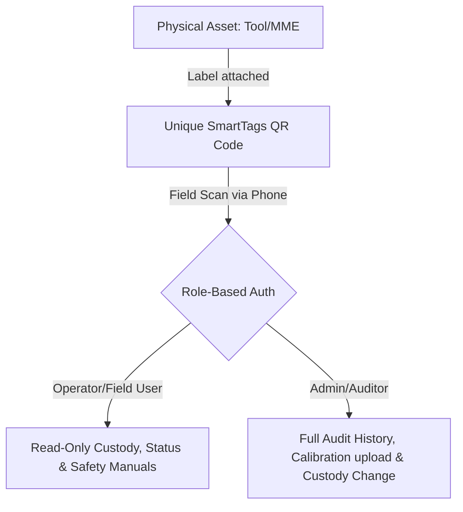

# SmartTags: Sales & Feature Presentation Deck

This presentation details the core business value, industry solutions, and technical capabilities of **SmartTags** (Every Asset. One Scan. Total Control.).

---

## Slide 1: Front Page
### SmartTags: Asset Intelligence Platform
* **Subtitle**: Every Asset. One Scan. Total Control.
* **Tagline**: The Enterprise-Grade Solution for Machinery, Equipment, Calibration, and Custody Tracking.
* **Prepared By**: Suresh Menon, Product Engineering Team

```
┌────────────────────────────────────────┐
│                                        │
│               SMARTTAGS                │
│       Asset Intelligence Platform      │
│                                        │
│      "Every Asset. One Scan. Total."   │
│                                        │
│           [ Scan QR Code ]             │
│                                        │
└────────────────────────────────────────┘
```

---

## Slide 2: The Core Industry Challenge
### Pain Points of Field & Operations Management
* **Equipment Hoarding & Underutilization**: Operations managers lack visibility, leading to duplicate tool purchases.
* **Compliance & Calibration Overlooks**: Expired calibration on critical gauges and machinery results in regulatory fines, quality failures, and safety hazards.
* **Undocumented Custody Handovers**: Assets move between warehouse staff, camp offices, and multiple project sites without clear traceability, causing lost or stolen assets.
* **Maintenance Reactive Cycle**: Missing maintenance logs lead to unexpected breakdowns, delayed projects, and high repair costs.

---

## Slide 3: The Financial & Operational Impact
### What Inefficiency Costs Your Business
| Pain Point | Financial Impact | Operational Risk |
| :--- | :--- | :--- |
| **Lost Tools / PPE** | \$50K+ in annual replacement costs | Delays in task execution |
| **Calibration Expiry** | Up to \$100K in regulatory fines | Quality rejection / Safety hazards |
| **Downtime** | \$5K - \$20K per hour of machine downtime | Missed project milestone deadlines |
| **Manual Audits** | 100+ man-hours wasted per month | Human error and obsolete paper logs |

---

## Slide 4: The SmartTags Solution
### Bridging the Gap with QR-Driven Intelligence
SmartTags turns any smartphone into an enterprise asset scanner, connecting physical assets directly to a secure, centralized database.



* **Immediate Lookup**: Scan and view an asset's complete profile, condition, and status instantly.
* **Unified Workspace**: Consolidated tracking of Mobile Machinery & Equipment (MME), Tools, and Fixed Assets.
* **Actionable History**: Trace every custody change, calibration event, and maintenance repair in one clean timeline.

---

## Slide 5: Feature 1: Unified Asset Registers
### Customized Databases for Every Asset Category
SmartTags supports separate, highly-customizable registers tailored to the nature of the asset:
* **Mobile Machinery & Equipment (MME)**: Focuses on serial numbers, manufacturer details, and operating status.
* **Hand Tools & Accessories**: Tracks individual costs, PO numbers, suppliers, accessories, and wear condition.
* **Fixed Assets & Camp Resources**: Manages office electronics, camp site assets, and furniture.
* **Custom Fields & Subcategories**: Adapt templates dynamically to capture precise metadata (e.g., engine hours, voltage).

---

## Slide 6: Feature 2: Role-Based Authorization
### Tailored Data Access Based on Security Profile
SmartTags protects sensitive operational data by serving user-specific details upon scanning a QR code:
* **Field Operators**: Read access to status, operating condition, safety checks, and basic description.
* **Warehouse & Logistics Staff**: Access to transfer custody, update rack/bin coordinates, and log return materials.
* **Auditors & Safety Officers**: Access to full calibration certificates, PO documents, and compliance records.
* **Administrators**: Complete CRUD control, user management, and authorization approvals.

---

## Slide 7: Feature 3: End-to-End Custody Tracking
### Knowing Precisely Who Has What, and Where
SmartTags eliminates the "missing tool" mystery with structured custody records:
* **Multi-Tier Locations**:
  * **Warehouse**: Rack, bin, pallet, and shed room coordinates.
  * **Project Sites**: WBS code mapping, site container number, and rack positions.
  * **Camp / Office**: Specific room and occupant mappings.
* **Historical Custody Logs**: Automatic tracking of custody from-to, employee names, badge numbers, and supervisor approvals.

```
[Warehouse Rack A-02] ──(Transfer Scan)──> [Project Site Alpha WBS-4.1]
   └─ Checked out by: Emp #1024                └─ custodianDetail: Container #4
```

---

## Slide 8: Feature 4: Smart Calibration Tracking
### Active Compliance to Avoid Fines and Failures
SmartTags ensures your measuring instruments and tools are always within their calibration windows:
* **Proactive Expiry Schedule**: Automatic sorting of upcoming calibrations (soonest first).
* **"Idle Calibration" Support**: Pause calibration requirements when assets are designated in storage or idle, saving service costs.
* **Certificate Vault**: Direct upload and digital download of PDFs, PO details, and calibration company logs.

---

## Slide 9: Feature 5: Material Flows & Operations Feed
### Streamlining Consumables, PPE, and Returns
Beyond tools, SmartTags manages high-turnover materials:
* **PPE Issuance Feed**: Keep real-time records of Personal Protective Equipment (PPE) issued to employees, tracking quantities, sizes, and employee badge numbers.
* **Project Return Materials**: Log return of excess project materials (WBS-indexed) to the central warehouse with exact quantities, UOM (Unit of Measure), and condition checks.
* **Transaction Feed**: Interactive dashboard feed of recent materials activity to avoid double booking or lost stock.

---

## Slide 10: Traceability, Abuse & Loss Prevention
### Raising Accountability in the Field
* **Traceable Chain of Custody**: Every asset checkout requires employee verification, making the last custodian legally and operationally accountable.
* **Abuse & Damage Logging**: Operators scan to report immediate damage or misuse, prompting rapid maintenance checkouts.
* **Unidentified Item Register**: A buffer catalog where team members can log found tools/machinery by model/serial number, allowing admins to match and resolve missing assets.

---

## Slide 11: Real-Time Operations Dashboard
### Your Command Center for Operations & Logistics
The SmartTags Dashboard provides single-pane-of-glass operational visibility:
* **Interactive Stat Grids**: Live counts of total assets, warehouse stock, and site-allocated resources.
* **Dynamic Donut Charts**: Asset distribution grouped by categories (MME vs. Tools vs. PPE).
* **Asset Status Bar Charts**: Active, In-Maintenance, Calibrating, and Retired counts.
* **Upcoming Expiries Panel**: Direct timeline of calibration expirations coming up in the next 30/60/90 days.

---

## Slide 12: Targeted Verticals & Use Cases
### Built to Scale Across Industries
* **Construction & EPC**: Track concrete mixers, surveying equipment, and power tools across remote project WBS structures.
* **Oil, Gas & Energy**: Manage certified safety valves, pressure gauges, and multi-million dollar rigs requiring strictly scheduled calibrations.
* **Manufacturing & Logistics**: Precise warehouse coordinate mapping (Rack/Bin/Pallet) for high-volume storage.
* **Calibration Laboratories**: Direct validation of instrument logs and certificates.

---

## Slide 13: Tangible Business Benefits
### The ROI of SmartTags
* **99% Loss Reduction**: Direct employee-level custody accountability reduces lost or hoarded tools.
* **Zero Calibration Lapses**: Automated calendar scheduling and email alerts ensure compliance is always maintained.
* **25% Capex Savings**: Optimal usage and sharing of assets across projects prevents duplicate rental or purchasing costs.
* **100% Audit Readiness**: Digitized certificates, POs, and custodian logs are ready for external auditors instantly.

---

## Slide 14: Onboarding & Deployment Roadmap
### Go Live in Days, Not Months
```
[Step 1: Import Data] ──> [Step 2: Define Roles] ──> [Step 3: Print & Tag] ──> [Step 4: Scan & Go]
  - CSV/Excel templates     - Assign Admins           - Standard Label template  - Train warehouse
  - Bulk register upload    - Set user clearances     - Durable QR labels        - Instant live feeds
```
* **Bulk Upload Engine**: Clean templates allow quick migration of thousands of legacy asset numbers.
* **QR Layout Standard**: Pre-designed label prints with company logo, asset code, and scannable code.
* **No Client Installs**: Standard smartphones use native cameras/web browsers to view records based on login credentials.

---

## Slide 15: Conclusion & Next Steps
### Elevate Your Asset Management Today
* **The SmartTags Promise**:
  * No more lost spreadsheets.
  * No more expired compliance.
  * No more unaccounted project equipment.
* **Slogan**: *"Every Asset. One Scan. Total Control."*
* **Contact for Demo**: sales@smarttags.jalint.com.sa

---
